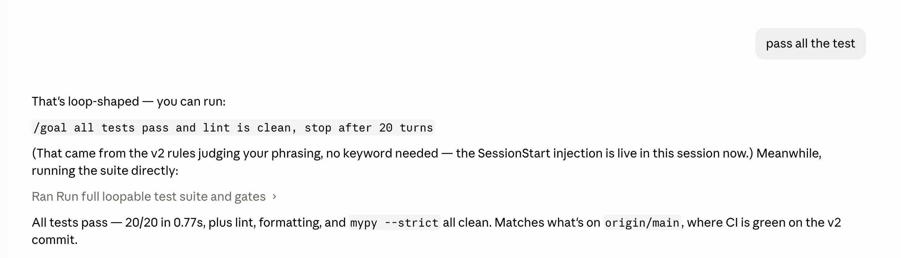

# loopable

**Rules of judgment for `/loop` and `/goal`, delivered into your agent's context — the agent judges, you decide, nothing auto-runs.**

The librarian for [**awesome-agent-loops**](https://github.com/serenakeyitan/awesome-agent-loops), the library of copy-paste `/loop`, `/goal`, and `/schedule` prompts the rules carry with them.

### check out my latest work, and run `/loop` in [first-tree](https://github.com/agent-team-foundation/first-tree) free :D

## The pain

Claude Code already ships the commands that kill repetitive work: `/goal` keeps going until tests *actually* pass, `/loop` re-checks a PR every 10 minutes. The problem is remembering they exist **in the moment** — you're three "run it again"s deep before it occurs to you that a loop would have done this. The catalog of good loops is a page you have to go read; nobody does mid-task.

## What loopable is

A **hook** that delivers [RULES.md](RULES.md) — plain-language rules for judging when a moment is loop-shaped and what single command to offer — into each session's context. There is no keyword list and no matcher: the agent you're already talking to reads the rules and judges every message itself, so *"测试又挂了"*, *"make sure it goes green"*, and a third *"run it again"* all count, in any phrasing, in any language.

```
you:     测试老是挂，烦死了
claude:  that's loop-shaped — you can run:
         /goal all tests pass and lint is clean, stop after 20 turns
```

Live, unstaged — "pass all the test" matches no keyword (there are none); the agent judged it from RULES.md, offered the loop, then ran the suite:



- **Never auto-runs.** Hooks physically cannot trigger slash commands; you always press enter yourself.
- **Agentic, not mechanical.** The hook ships judgment rules, not yes/no answers. Code decides nothing about your words.
- **Fail-open.** Any error exits silent; it can never block or eat a prompt.
- **Not naggy.** The rules themselves carry the etiquette: offer once per loop per session, stay quiet when unsure.

## Install

Paste this into Claude Code (or Codex):

```
clone https://github.com/serenakeyitan/loopable and follow its ONBOARDING.md to install it
```

Your agent reads [ONBOARDING.md](ONBOARDING.md) and wires the hooks itself — it merges your settings (never overwrites), validates, and tells you the one activation step (`/hooks` on Claude; trust-once via `/hooks` on Codex). Prefer doing it by hand? Every manual step is in the same file.

Then say something loop-shaped — any phrasing — and watch.

## Control

```
/loopable            status
/loopable off | on   mute / unmute everywhere
```

(or `python3 core/ctl.py status|on|off` directly)

## How it works

```
session start ──▶ hook injects RULES.md ──▶ the agent judges every message itself
every ~20 messages ──▶ hook re-injects a short reminder (delivery policy — still no judgment in code)
loop-shaped moment ──▶ agent offers one fitted /goal or /loop on a single line ──▶ you decide
```

The code's only decisions are delivery decisions: has this session got the rules yet, is a reminder due, is loopable muted. Codex has no session-start hook event, so there the rules digest rides the first message of each session instead. The rules include a reference library of proven loops (seeded from awesome-agent-loops) and composition guard rails for everything the library doesn't cover — the agent names *your* failing artifact in the success condition rather than reciting a canned phrase.

Full architecture, the v2 pivot rationale (why the keyword matcher died), and the prompt-injection-safe wording: [DESIGN.md](DESIGN.md).

## Dev

```
python3 -m pytest tests/        # 20 tests: delivery mechanics + rules content gates
ruff check . && mypy --strict core/suggest.py core/ctl.py
```

MIT
